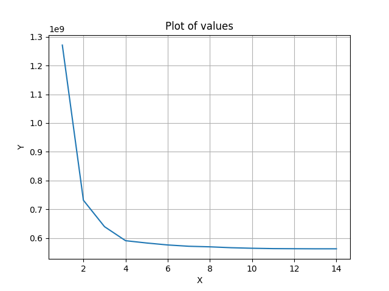

# README

## Overview

This repository contains Python scripts for various clustering algorithms and a point generation script. Each script reads a CSV file containing points and performs clustering using different algorithms. The results are saved as image files. The directory also contains example images generated by these scripts.

## Directory Structure

```
.
├── affinity_propagation.py
├── complete-link.py
├── K-medians.py
├── K-medians_Elbow.py
├── mean-shift_clustering.py
├── points_creator.py
├── requirements.txt
└── Example images
    ├── affinity_propagation.png
    ├── complete_link.png
    ├── elbow.png
    ├── K-medians.png
    ├── mean-shift_clustering.png
    └── scatter_animation.gif
```

## Installation

To install the required dependencies, run the following command:

```bash
pip install -r requirements.txt
```
## Example Images

The `Example images` directory contains the following images generated by the scripts:

### Affinity Propagation Clustering


### Complete Linkage Clustering


### Elbow Method for K-medians


### K-medians Clustering


### Mean-Shift Clustering


### Mean-Shift Clustering Animation


These images serve as examples of what the output of each script might look like.

## Scripts

### points_creator.py

This script generates random points for clustering.

#### Usage

```bash
python points_creator.py --amount <number_of_points_per_cluster> --dimensions <number_of_dimensions> --max_value <max_value_for_points> --max_bias <max_bias_for_cluster_center> --clusters <number_of_clusters> --file <output_csv_file>
```

#### Example

```bash
python points_creator.py --amount 150 --dimensions 2 --max_value 250 --max_bias 1500 --clusters 10 --file points.csv
```

### affinity_propagation.py

This script performs clustering using the Affinity Propagation algorithm.

#### Usage

```bash
python affinity_propagation.py --file <input_csv_file> --result_file <output_image_file> --max_iterations <maximum_iterations>
```

#### Example

```bash
python affinity_propagation.py --file points.csv --result_file affinity_propagation.png --max_iterations 10000
```

### complete-link.py

This script performs clustering using the Complete Linkage method.

#### Usage

```bash
python complete-link.py --file <input_csv_file> --result_file <output_image_file>
```

#### Example

```bash
python complete-link.py --file points.csv --result_file complete_link.png
```

### K-medians.py

This script performs clustering using the K-medians algorithm.

#### Usage

```bash
python K-medians.py --file <input_csv_file> --result_file <output_image_file> --clusters <number_of_clusters> --tries <number_of_attempts>
```

#### Example

```bash
python K-medians.py --file points.csv --result_file K-medians.png --clusters 10 --tries 100
```

### K-medians_Elbow.py

This script uses the Elbow method to determine the optimal number of clusters for K-medians clustering.

#### Usage

```bash
python K-medians_Elbow.py --file <input_csv_file> --result_file <output_image_file> --k_amount <max_number_of_clusters> --tries_per_k <number_of_attempts_per_k>
```

#### Example

```bash
python K-medians_Elbow.py --file points.csv --result_file elbow.png --k_amount 10 --tries_per_k 10
```

### mean-shift_clustering.py

This script performs clustering using the Mean-Shift algorithm and can generate an animation of the clustering process.

#### Usage

```bash
python mean-shift_clustering.py --file <input_csv_file> --result_file <output_image_file> --animation_file <output_gif_file> --gravity_range <gravity_range> --gravity_power <gravity_power> --max_iterations <maximum_iterations> --movement_threshold <movement_threshold> --with_animation <1_or_0>
```

#### Example

```bash
python mean-shift_clustering.py --file points.csv --result_file mean_shift_clustering.png --animation_file scatter_animation.gif --gravity_range 350 --gravity_power 0.1 --max_iterations 100 --movement_threshold 0.1 --with_animation 1
```